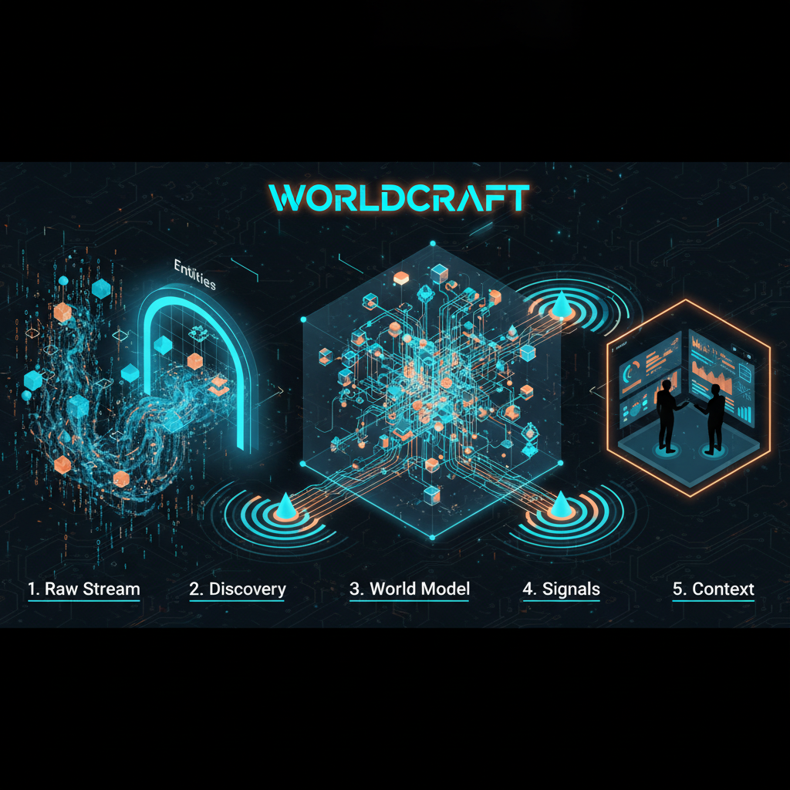
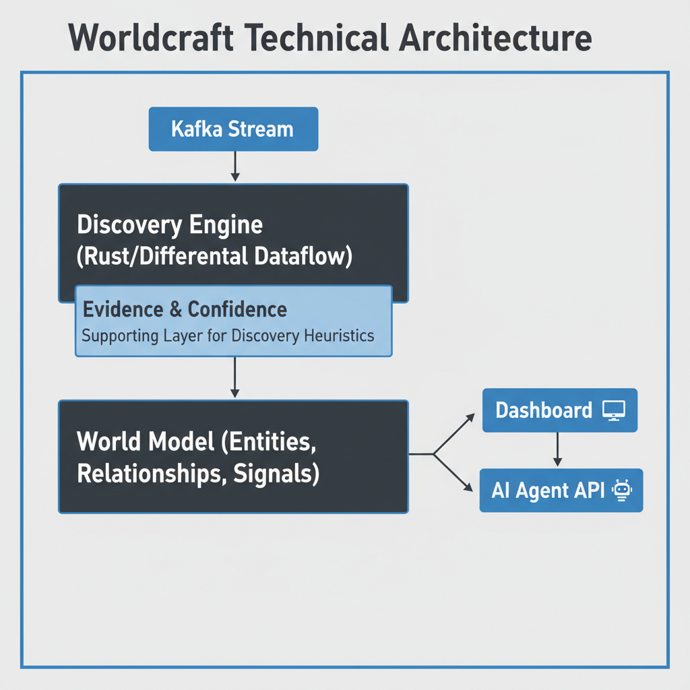

# Worldcraft

> **Worldcraft continuously turns raw streams into a living, queryable world model—so humans and agents always know what is true right now.**

---

## 📚 Table of Contents

- [The Vision](#the-vision)
- [How It Works](#how-it-works)
- [Architecture](#architecture)
- [Getting Started](#getting-started)
- [Documentation](#documentation)
- [Project Status](#project-status)

---

## The Vision

Most data platforms answer "What happened?" by querying logs. Worldcraft answers **"What is true right now?"** by maintaining a continuously evolving state of the world.

It walks up to any raw event stream and autonomously constructs a **World Model**—discovering entities, inferring relationships, and detecting signals without requiring manual schema definitions.

### The Identity Stack
*   **Worldcraft Discovery:** The brain that profiles streams to find Entities and Relationships.
*   **World Model:** The living, graph-based "product" that represents current reality.
*   **Worldcraft Signals:** The pulse that detects meaningful semantic changes in the model.
*   **Worldcraft Context:** The voice that delivers high-fidelity, agent-ready snapshots.

---

## How It Works

1.  **Connect:** You point Worldcraft at a raw Kafka topic.
2.  **Discover:** It uses statistical heuristics to propose hypotheses (e.g., "This looks like a `User` entity").
3.  **Refine:** A human operator (or agent) provides a simple "Approve" signal.
4.  **Evolve:** The model updates incrementally with every new event using **Differential Dataflow**.

**[📖 Read the full Story & Vision here](./docs/STORY.md)**

---

## Architecture

Worldcraft is built on a **Plane-based Architecture**:

*   **Data Plane (Rust):** High-performance ingestion and Differential Dataflow for incremental computation.
*   **Discovery Plane:** Generates hypotheses and confidence scores.
*   **Commitment Plane:** Manages versioned, durable state (SQLite).
*   **Control Plane:** Handles human-in-the-loop approvals.
*   **Presentation Plane:** Serves the Dashboard and Agent Context API.

---

## Getting Started

Worldcraft is currently in active development. The following commands control the lifecycle:

| Command | Description |
|:---|:---|
| `make dev` | Start the API and Dashboard |
| `make ingest` | Run the ingestion and discovery loop |
| `make demo` | Replay demo events into Kafka |
| `make test` | Run unit tests and the discovery harness |
| `make dd_poc` | Run the Timely/Differential Dataflow proof-of-concept |
| `make dd_eval` | Evaluate DD POC output against expected discoveries |
| `make eval` | Evaluate discovery output against expected discoveries |
| `make sqlite_smoke` | Verify SQLite snapshot read/write |

See **[`docs/dev-plan.md`](./docs/dev-plan.md)** for full infrastructure setup instructions.

---

## Documentation

### Core Plans
*   **[Product Plan](./worldcraft_product_plan.md):** The master product strategy.
*   **[Developer Plan](./docs/dev-plan.md):** Infrastructure and development roadmap.
*   **[Demo Plan](./docs/demo-plan.md):** Script and success criteria for the v1 demo.

### Technical Deep Dives
*   **[Architecture Decisions](./docs/architecture-decisions.md):** ADRs and technical rationale.
*   **[Schemas](./docs/schemas.md):** Data structures for Evidence, Confidence, and Storage.
*   **[Discovery Metrics](./docs/discovery-metrics.md):** Precision/Recall tracking.
*   **[DD Learning Guide](./docs/dd-learning-guide.md):** Guide to Differential Dataflow.

### Agent Guidance
*   **[AGENTS.md](./AGENTS.md):** Instructions for AI agents working on this repo.

---

## Project Status

**Current Phase: Phase 0 (Foundation)**

We are currently building the foundation:
*   ✅ Project Scaffolding
*   ✅ Differential Dataflow Proof-of-Concept
*   🚧 Discovery Evaluation Harness
*   📅 **Next:** Phase 1 - Core Discovery Loop (Ingestion -> Hypothesis)

---

*Worldcraft: The Living World Model.*